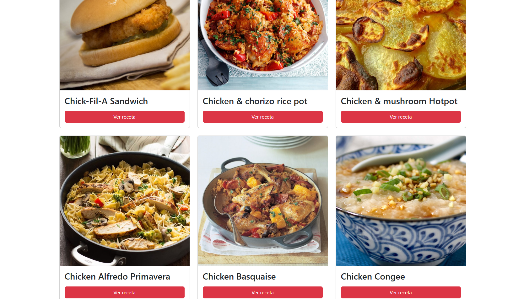

# MealDB Recipe Finder (Vanilla JS)

Aplicación frontend que consume **TheMealDB API** para explorar recetas por categoría, ver el detalle en un modal y guardar favoritos con persistencia en el navegador.

## Capturas

### Inicio (selección de categoría)


### Listado de recetas



### Vista móvil


### Favoritos


## Demo

- Live: https://themealdb-recipe-explorer.vercel.app/
- Repo: https://github.com/Danielroxs/mealdb-recipe-finder?tab=readme-ov-file

## Funcionalidades

- Listado de recetas por **categoría** (consumo de API)
- **Modal** con detalle de receta (imagen + instrucciones)
- **Favoritos** persistentes con **LocalStorage**
- Interfaz **responsive** (mobile-first)
- Feedback de acciones (toast/notificación)

## Stack

- HTML
- CSS
- JavaScript (Vanilla)
- Bootstrap 5
- Fetch API
- LocalStorage
- TheMealDB API

## Cómo correrlo local

Opción 1 (VSCode):

- Abre el proyecto y usa **Live Server**

Opción 2 (servidor local simple):

```bash
npx serve
```
